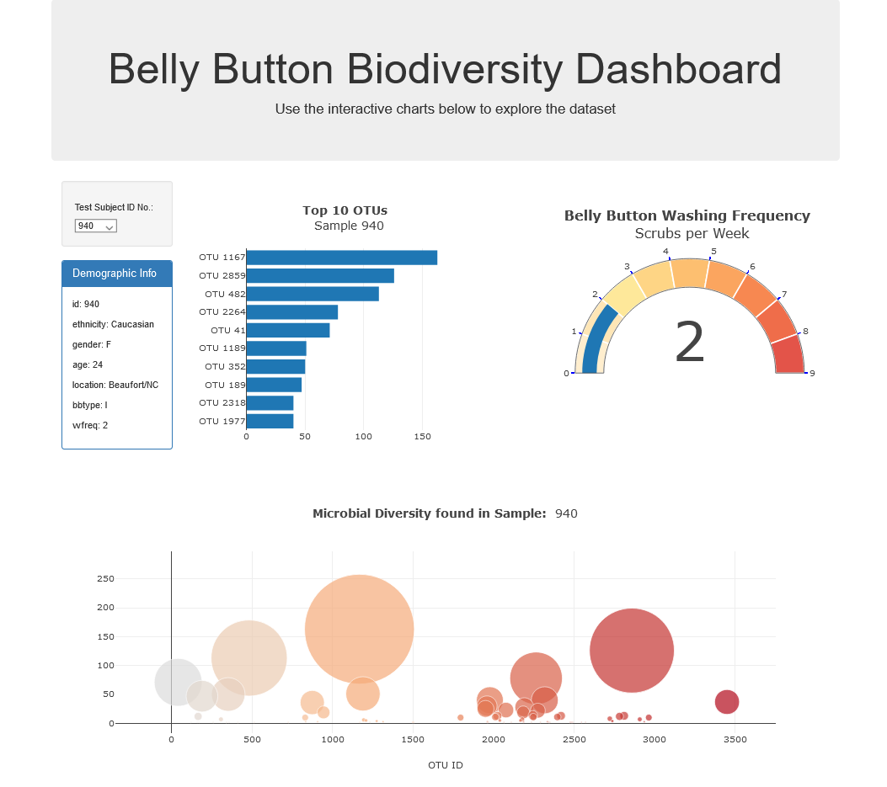

# Plotly-JavaScript-challenge
Project to build an interactive dashboard to explore the Belly Button Biodiversity dataset, which catalogs the microbes that colonize human navels.

The dataset reveals that a small handful of microbial species (also called operational taxonomic units, or OTUs, in the study) were present in more than 70% of people, while the rest were relatively rare.
The following factors like age, sex, ethnicity, innie vs outie, and frequency of washing were investigated during the conducted study. However, none of them explained differences in the number and kinds of bacteria which was found in a particular person.

The dashboard has been developed in JavaScript using Plotly.js and D3.js.

---
### Final Dashboard

* 
The final dashboard is deployed on GitHub Pages and can be found <a href=https://agkden.github.io/ >here</a>

* The screenshot is shown below:

### About the Data

Hulcr, J. et al.(2012) _A Jungle in There: Bacteria in Belly Buttons are Highly Diverse, but Predictable_. Retrieved from: [http://robdunnlab.com/projects/belly-button-biodiversity/results-and-data/](http://robdunnlab.com/projects/belly-button-biodiversity/results-and-data/)
